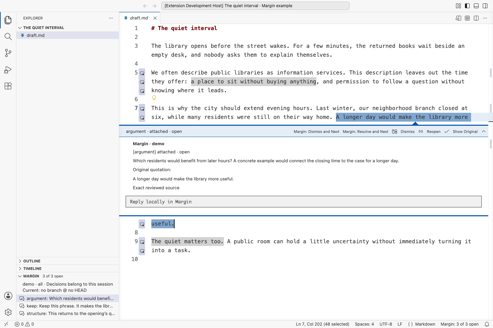
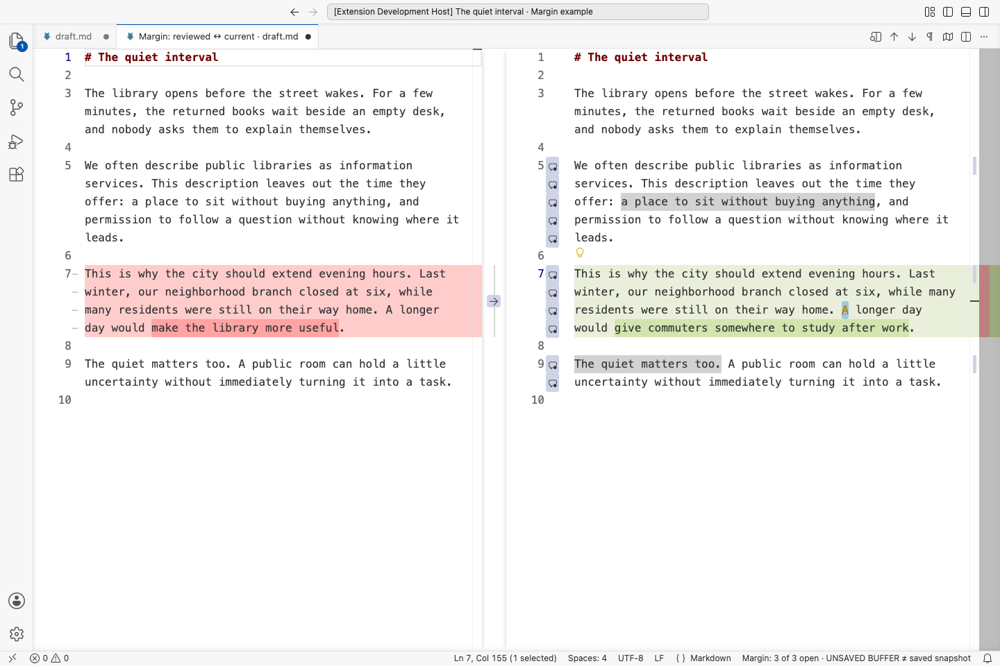

# Margin

Margin brings editorial comments into VS Code, beside the passages they refer to. Ask an AI model to review your Markdown, Typst, or LaTeX file, then work through the feedback as you revise.

You decide what to change. Margin never rewrites, saves, or commits your draft.



The sidebar keeps track of the review, while comments open next to your text. This screenshot uses illustrative comments created for the documentation, without a model call.

## Try the example

You need Node 22 or 24 LTS, npm, and desktop VS Code 1.100 or newer. From this repository's folder, run:

```sh
npm run setup
npm run demo
code --reuse-window .demo/markdown
```

Setup installs the Margin command-line tool and VS Code extension. The demo creates an example draft and review; it needs no login and sends nothing to a model.

In VS Code:

1. Open the Command Palette: `Cmd+Shift+P` on macOS, or `Ctrl+Shift+P` on Windows/Linux. Run **Developer: Reload Window** after installation.
2. Trust the example folder if prompted, then open `draft.md`.
3. Run **Margin: Select Review** from the Command Palette. Click a comment in the Margin sidebar to read it beside the draft.

The demo also includes Typst and multi-file LaTeX examples. Running it again preserves your edits and creates another review. If setup cannot find VS Code or the `margin` command, see [installation help](docs/installation.md).

## Review your writing

Codex reviews currently require macOS and Codex CLI **0.154.0**, with a [supported login](docs/codex-safety.md#authentication-failures-and-limits). Margin does not install or sign in to Codex for you.

Open your writing project's folder in VS Code. Save the draft, then run these commands in a terminal in that same folder:

```sh
margin init
margin review draft.md --provider codex \
  --brief "Focus on argument and pacing. Preserve my voice; let the opening breathe." \
  --max-comments 8
```

Run `margin init` once per project. The brief tells the reviewer what matters to you; the comment limit is a ceiling, so fewer than eight is fine. When the review finishes, use **Margin: Select Review** to open it. **Margin: Show Editorial Letter** opens the review's overall observations.

The terminal command reads saved files. Margin labels unsaved editor changes, but never saves them for you. It supports `.md`, `.markdown`, `.typ`, and `.tex` without compiling or rendering them.

The command and VS Code must use the same project folder. To review the demo while your terminal is still in the Margin repository, specify its folder explicitly:

```sh
margin review draft.md --root .demo/markdown --provider codex
```

File arguments are relative to `--root`, which defaults to the terminal's current folder. Use `--provider mock` to try the workflow without a model. If Codex stalls or fails, see [troubleshooting](docs/usage.md#troubleshooting).

## Work through the comments

Use **Next Open Comment** and **Previous Open Comment**, or the arrow buttons in the Margin sidebar, to move through the review. Navigation skips resolved and dismissed comments. The sidebar and status bar show how many remain open.

You can reply locally, resolve a discussion, dismiss feedback you do not want to pursue, or reopen a comment. Resolving or dismissing closes the comment without changing your text. **Resolve and Next** and **Dismiss and Next** also move to the next open comment. See [navigation and shortcuts](docs/usage.md#navigation-and-shortcuts) for the details.

Comments follow passages as you edit. If you rewrite a passage, Margin marks its comment as changed when it can still identify the location. If the passage disappears or its location becomes ambiguous, the comment stays in the sidebar without a highlight. You can read the original passage or reattach the comment to a selection yourself.

**Compare Reviewed Version with Current** opens the saved review copy beside your current text, including unsaved changes:



Here the author has revised the passage. The review keeps the original quotation so the feedback still has context. The edit was made only in the temporary screenshot example.

## Focus on particular passages

Choose individual lines or several ranges:

```sh
margin review draft.md --provider codex --lines 12-25,40-55 \
  --brief "Focus on the reasoning and transitions in these passages."
```

Line numbers start at 1, include both endpoints, and refer to the saved file. The reviewer receives the full selected file as context, but local comments must fall within the chosen ranges. Margin rejects comments outside them.

For a paper spread across files, list those files in `.reviews/config.json`. Then use `--project`, with an optional focus for each file:

```sh
margin review --project --provider codex \
  --focus sections/introduction.tex:12-25 \
  --focus sections/methods.tex:40-55,70
```

See the [project configuration guide](docs/usage.md#multi-file-projects) and [LaTeX example](examples/latex). Margin uses the file list you provide; it does not search for included files on its own.

## Use another reviewer

You can prepare a review without Codex or credentials:

```sh
margin prepare draft.md --brief "Review the argument." --max-comments 8
```

This saves a copy of your source and prints paths to a review packet and the required response format. Give those files to your chosen reviewer, save its JSON response, then import it with the printed request ID:

```sh
margin import request-REPLACE-WITH-RETURNED-ID response.json
```

Import checks the response against the saved copy, even if you have since edited the draft. It rejects an invalid response as a whole. See [prepare and import](docs/usage.md#prepare-and-import) for line focus, scripting, and error handling.

## Your files and privacy

Margin stores reviews, replies, and saved source copies in your project's `.reviews` folder. That folder has its own Git ignore file, so reviews stay out of Git by default. The saved copies contain the full text of the selected files.

A Codex review sends the selected source and context to Codex. Margin does not send unrelated files, Git history, or earlier reviews. Replies stay local, and the extension never calls a model. The [Codex protection policy](docs/codex-safety.md) explains the supported setup and its limits; manually using another agent falls outside that protection.

The current version supports one project folder and one selected review at a time. It can track exact passages and some edits, but it cannot decide whether a criticism still applies. You make that judgment.

## Update

From this repository's folder:

```sh
git pull --ff-only
npm run setup
```

Then run **Developer: Reload Window** in VS Code. Your drafts and review decisions stay in place. See [installation and updates](docs/installation.md) for other install locations, packaged downloads, and uninstalling.

## Develop and test

```sh
npm run build
npm run typecheck
npm test
npm run test:extension
npm run test:install
npm run screenshots
npm run package
```

For extension development, run `npm run demo`, open this repository in VS Code, and press F5. This opens a separate Extension Development Host window; ordinary use stays in your existing editor.

`npm run screenshots` uses Playwright to capture the installed VS Code application with the development extension and a temporary example project. [Screenshot instructions](docs/screenshots.md) explain how to reproduce the images. Packaging creates a CLI archive and a VS Code extension file in `dist/`; nothing is published.

See [architecture](docs/architecture.md) for storage and anchoring, and [verification notes](docs/testing.md) for test coverage and checks that still need a person.
